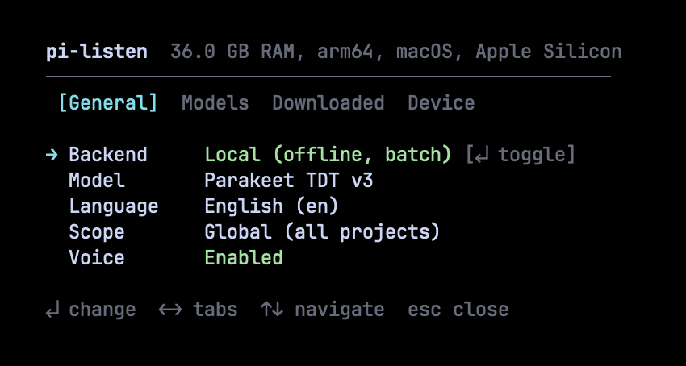
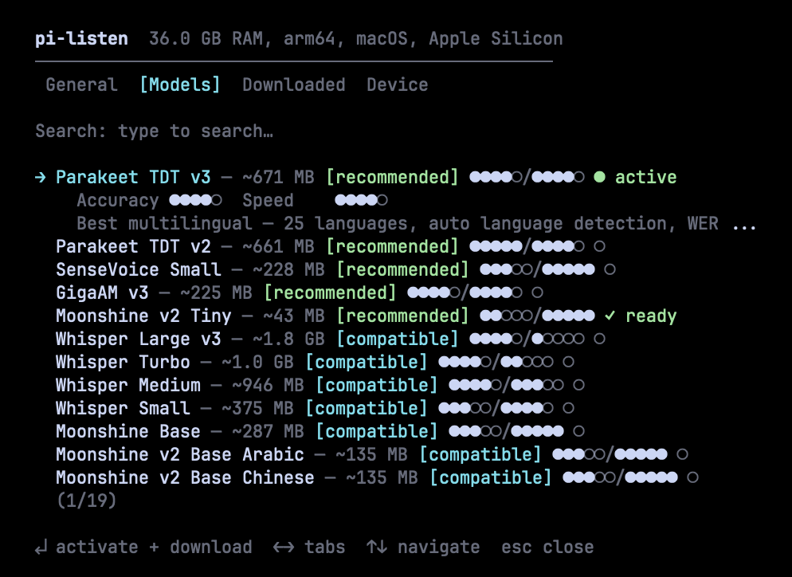
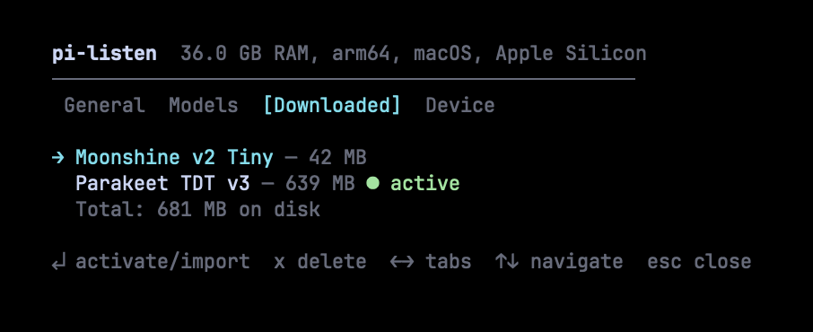
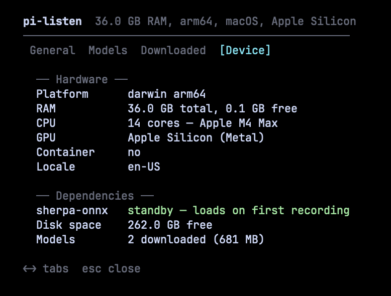

[English](README.md) | [简体中文](README.zh-CN.md) | [日本語](README.ja.md) | [한국어](README.ko.md) | [Español](README.es.md) | [Français](README.fr.md) | [Português](README.pt-BR.md) | [हिन्दी](README.hi.md)

# pi-listen

<p align="center">
  
</p>

**[Pi](https://github.com/mariozechner/pi-coding-agent) के लिए होल्ड-टू-टॉक वॉइस इनपुट।** Deepgram के ज़रिए क्लाउड स्ट्रीमिंग या लोकल मॉडल के साथ पूरी तरह ऑफ़लाइन।

[](https://www.npmjs.com/package/@codexstar/pi-listen)
[](https://github.com/codexstar69/pi-listen/blob/main/LICENSE)
[](https://x.com/baanditeagle)

> **v5.0.1 — सुरक्षा पैच** — API कुंजियाँ अब प्रोजेक्ट कॉन्फ़िग में लीक नहीं होतीं। माइक ऑडियो को दुर्भावनापूर्ण रिपो सेटिंग्स के ज़रिए रिमोट सर्वर पर रीडायरेक्ट नहीं किया जा सकता। API कुंजी ऑनबोर्डिंग में शेल इंजेक्शन ठीक किया गया। कॉन्फ़िग राइट्स अब एटॉमिक हैं। [पूरा चेंजलॉग →](CHANGELOG.md)

---

## देखें कैसे काम करता है

<video src="assets/pi-listen.mp4" controls width="100%"></video>

---

## सेटअप (2 मिनट)

### 1. एक्सटेंशन इंस्टॉल करें

```bash
# सामान्य टर्मिनल में चलाएँ (Pi के अंदर नहीं)
pi install npm:@codexstar/pi-listen
```

### 2. अपना बैकएंड चुनें

pi-listen दो ट्रांसक्रिप्शन बैकएंड सपोर्ट करता है:

| | Deepgram (क्लाउड) | लोकल मॉडल (ऑफ़लाइन) |
|---|---|---|
| **कैसे काम करता है** | लाइव स्ट्रीमिंग — बोलते समय टेक्स्ट दिखता है | बैच मोड — रिकॉर्डिंग पूरी होने के बाद ट्रांसक्राइब करता है |
| **सेटअप** | API कुंजी ज़रूरी | कोई API कुंजी नहीं, पहले उपयोग पर मॉडल ऑटो-डाउनलोड |
| **इंटरनेट** | ज़रूरी | मॉडल डाउनलोड के बाद ज़रूरी नहीं |
| **लेटेंसी** | रियल-टाइम अंतरिम परिणाम | रिकॉर्डिंग रुकने के बाद 2–10 सेकंड |
| **भाषाएँ** | 56+ लाइव स्ट्रीमिंग के साथ | मॉडल पर निर्भर (1–57 भाषाएँ) |
| **लागत** | $200 मुफ़्त क्रेडिट (अधिकांश डेवलपर्स के लिए 6–12 महीने चलता है) | हमेशा मुफ़्त |

Pi के अंदर `/voice-settings` चलाएँ — बैकएंड चुनें और सब कुछ एक पैनल से कॉन्फ़िगर करें।

#### विकल्प A: Deepgram (लाइव स्ट्रीमिंग के लिए अनुशंसित)

[dpgr.am/pi-voice](https://dpgr.am/pi-voice) पर साइन अप करें — $200 मुफ़्त क्रेडिट, कार्ड की ज़रूरत नहीं।

```bash
export DEEPGRAM_API_KEY="your-key-here"    # ~/.zshrc या ~/.bashrc में जोड़ें
```

#### विकल्प B: लोकल मॉडल (पूरी तरह ऑफ़लाइन)

कोई सेटअप ज़रूरी नहीं — `/voice-settings` चलाएँ, बैकएंड को Local में बदलें और मॉडल चुनें। यह अपने आप डाउनलोड हो जाएगा।

> **नोट:** लोकल मॉडल बैच मोड में काम करते हैं — बोलते समय नहीं, बल्कि रिकॉर्डिंग पूरी होने के बाद ट्रांसक्राइब करते हैं। बोलते समय लाइव स्ट्रीमिंग के लिए Deepgram का उपयोग करें।

### 3. Pi खोलें

पहली बार शुरू करने पर, pi-listen आपका सेटअप जाँचता है और बताता है क्या तैयार है:
- बैकएंड कॉन्फ़िगर हो गया (Deepgram कुंजी या लोकल मॉडल)
- ऑडियो कैप्चर टूल मिल गया (sox, ffmpeg, या arecord)
- अगर सब कुछ ठीक है, तो वॉइस तुरंत सक्रिय हो जाता है

### ऑडियो कैप्चर

pi-listen आपके ऑडियो टूल को ऑटो-डिटेक्ट करता है। अगर sox या ffmpeg पहले से इंस्टॉल है तो मैन्युअल इंस्टॉलेशन ज़रूरी नहीं।

| प्राथमिकता | टूल | प्लेटफ़ॉर्म | इंस्टॉल |
|------------|------|-----------|---------|
| 1 | **SoX** (`rec`) | macOS, Linux, Windows | `brew install sox` / `apt install sox` / `choco install sox` |
| 2 | **ffmpeg** | macOS, Linux, Windows | `brew install ffmpeg` / `apt install ffmpeg` |
| 3 | **arecord** | केवल Linux | पहले से इंस्टॉल (ALSA) |

---

## सेटिंग्स पैनल

सारी कॉन्फ़िगरेशन एक जगह: `/voice-settings`। चार टैब सब कुछ कवर करते हैं।

### सामान्य — बैकएंड, भाषा, स्कोप



Deepgram (क्लाउड, लाइव स्ट्रीमिंग) और Local (ऑफ़लाइन, बैच मोड) के बीच स्विच करें। भाषा, स्कोप बदलें और वॉइस को चालू/बंद करें — सब कीबोर्ड शॉर्टकट से।

### मॉडल — ब्राउज़ करें, खोजें, इंस्टॉल करें



Parakeet, Whisper, Moonshine, SenseVoice और GigaAM के 19 मॉडल ब्राउज़ करें। हर मॉडल सटीकता और गति रेटिंग (●●●●○/●●●●○), उपयुक्तता बैज और डाउनलोड स्थिति दिखाता है। मॉडल तेज़ी से खोजने के लिए फ़ज़ी सर्च। Enter दबाएँ सक्रिय करने और डाउनलोड करने के लिए।

### डाउनलोड किए गए — इंस्टॉल किए गए मॉडल प्रबंधित करें



देखें क्या इंस्टॉल है, कुल डिस्क उपयोग और कौन सा मॉडल सक्रिय है। Enter से सक्रिय करें, `x` से हटाएँ। [Handy](https://github.com/cjpais/handy) के मॉडल ऑटो-डिटेक्ट होते हैं और बिना दोबारा डाउनलोड किए इम्पोर्ट हो सकते हैं।

### डिवाइस — हार्डवेयर प्रोफ़ाइल और डिपेंडेंसी



अपनी हार्डवेयर प्रोफ़ाइल (RAM, CPU, GPU), डिपेंडेंसी स्टेटस (sherpa-onnx रनटाइम), उपलब्ध डिस्क स्पेस और कुल डाउनलोड किए गए मॉडल देखें। मॉडल सिफ़ारिशें इस प्रोफ़ाइल पर आधारित हैं।

---

## उपयोग

### की-बाइंडिंग

| कार्य | कुंजी | नोट्स |
|-------|-------|-------|
| **एडिटर में रिकॉर्ड करें** | `SPACE` दबाए रखें (≥1.2 सेकंड) | छोड़ें तो फ़ाइनल हो जाता है। वॉर्मअप के दौरान प्री-रिकॉर्ड करता है ताकि कोई शब्द न छूटे। |
| **रिकॉर्डिंग टॉगल** | `Ctrl+Shift+V` | सभी टर्मिनल में काम करता है — शुरू करने के लिए दबाएँ, रोकने के लिए फिर दबाएँ। |
| **एडिटर साफ़ करें** | `Escape` × 2 | 500ms के अंदर डबल-टैप से सारा टेक्स्ट साफ़। |

### रिकॉर्डिंग कैसे काम करती है

1. **SPACE दबाए रखें** — वॉर्मअप काउंटडाउन दिखता है, ऑडियो कैप्चर तुरंत शुरू (प्री-रिकॉर्डिंग)
2. **दबाए रखें** — लाइव ट्रांसक्रिप्शन एडिटर में स्ट्रीम होता है (Deepgram) या ऑडियो बफ़र होता है (लोकल)
3. **SPACE छोड़ें** — आखिरी शब्द पकड़ने के लिए 1.5 सेकंड और रिकॉर्डिंग जारी रहती है (टेल रिकॉर्डिंग), फिर फ़ाइनल
4. टेक्स्ट एडिटर में दिखता है, भेजने के लिए तैयार

### कमांड

| कमांड | विवरण |
|-------|-------|
| `/voice-settings` | सेटिंग्स पैनल — बैकएंड, मॉडल, भाषा, स्कोप, डिवाइस |
| `/voice-models` | सेटिंग्स पैनल (मॉडल टैब) |
| `/voice test` | पूरा डायग्नोस्टिक — ऑडियो टूल, माइक, API कुंजी |
| `/voice on` / `off` | वॉइस चालू या बंद करें |
| `/voice dictate` | लगातार डिक्टेशन (कुंजी दबाए रखने की ज़रूरत नहीं) |
| `/voice stop` | सक्रिय रिकॉर्डिंग या डिक्टेशन रोकें |
| `/voice history` | हाल की ट्रांसक्रिप्शन |
| `/voice` | चालू/बंद टॉगल |

---

## लोकल मॉडल

5 परिवारों में 19 मॉडल। गुणवत्ता के अनुसार क्रमबद्ध — सबसे अच्छे मॉडल पहले।

### शीर्ष चयन

| मॉडल | सटीकता | गति | आकार | भाषाएँ | नोट्स |
|------|---------|-----|-------|--------|-------|
| **Parakeet TDT v3** | ●●●●○ | ●●●●○ | 671 MB | 25 (ऑटो-डिटेक्ट) | सर्वश्रेष्ठ समग्र। WER 6.3%। |
| **Parakeet TDT v2** | ●●●●● | ●●●●○ | 661 MB | अंग्रेज़ी | अंग्रेज़ी में सर्वश्रेष्ठ। WER 6.0%। |
| **Whisper Turbo** | ●●●●○ | ●●○○○ | 1.0 GB | 57 | सबसे व्यापक भाषा समर्थन। |

### तेज़ और हल्के

| मॉडल | सटीकता | गति | आकार | भाषाएँ | नोट्स |
|------|---------|-----|-------|--------|-------|
| **Moonshine v2 Tiny** | ●●○○○ | ●●●●● | 43 MB | अंग्रेज़ी | 34ms लेटेंसी। Raspberry Pi अनुकूल। |
| **Moonshine Base** | ●●●○○ | ●●●●● | 287 MB | अंग्रेज़ी | एक्सेंट को अच्छे से हैंडल करता है। |
| **SenseVoice Small** | ●●●○○ | ●●●●● | 228 MB | zh/en/ja/ko/yue | CJK भाषाओं के लिए सर्वश्रेष्ठ। |

### विशेषज्ञ

| मॉडल | सटीकता | गति | आकार | भाषाएँ | नोट्स |
|------|---------|-----|-------|--------|-------|
| **GigaAM v3** | ●●●●○ | ●●●●○ | 225 MB | रूसी | रूसी पर Whisper से 50% कम WER। |
| **Whisper Medium** | ●●●●○ | ●●●○○ | 946 MB | 57 | अच्छी सटीकता, मध्यम गति। |
| **Whisper Large v3** | ●●●●○ | ●○○○○ | 1.8 GB | 57 | Whisper की सबसे ऊँची सटीकता। CPU पर धीमा। |

इसके अलावा जापानी, कोरियाई, अरबी, चीनी, यूक्रेनी, वियतनामी और स्पेनिश के लिए 8 भाषा-विशेष Moonshine v2 वैरिएंट।

### लोकल मॉडल कैसे काम करते हैं

```
SPACE दबाए रखें → ऑडियो मेमोरी बफ़र में कैप्चर
                     ↓
SPACE छोड़ें → बफ़र sherpa-onnx को भेजा जाता है (इन-प्रोसेस)
                     ↓
              CPU पर ONNX इन्फ़रेंस (2–10 सेकंड)
                     ↓
              अंतिम ट्रांसक्रिप्ट एडिटर में डाला जाता है
```

मॉडल पहले उपयोग पर अपने आप डाउनलोड होते हैं। डाउनलोड रिज़्यूम हो सकते हैं, पूरा होने के बाद सत्यापित होते हैं, और डुप्लीकेट नहीं होते। सेटिंग्स पैनल में रियल-टाइम डाउनलोड प्रगति, गति और ETA दिखता है।

[Handy](https://github.com/cjpais/handy) (`~/Library/Application Support/com.pais.handy/models/`) के मॉडल ऑटो-डिटेक्ट होते हैं और सिम्लिंक के ज़रिए इम्पोर्ट हो सकते हैं (शून्य डिस्क डुप्लीकेशन)।

---

## सुविधाएँ

| सुविधा | विवरण |
|--------|-------|
| **दोहरा बैकएंड** | Deepgram (क्लाउड, लाइव स्ट्रीमिंग) या लोकल मॉडल (ऑफ़लाइन, बैच) — सेटिंग्स में स्विच करें |
| **19 लोकल मॉडल** | Parakeet, Whisper, Moonshine, SenseVoice, GigaAM — सटीकता/गति रेटिंग सहित |
| **एकीकृत सेटिंग्स पैनल** | सारी कॉन्फ़िगरेशन एक ओवरले पैनल में — `/voice-settings` |
| **डिवाइस-अवेयर सिफ़ारिशें** | आपके हार्डवेयर के हिसाब से मॉडल स्कोर करता है। केवल बेस्ट-इन-क्लास मॉडल को [recommended] मिलता है। |
| **एंटरप्राइज़ डाउनलोड पाइपलाइन** | प्री-चेक (डिस्क, नेटवर्क, अनुमतियाँ), गति/ETA के साथ लाइव प्रगति, डाउनलोड बाद सत्यापन |
| **Handy इंटीग्रेशन** | Handy ऐप के मॉडल ऑटो-डिटेक्ट, सिम्लिंक से इम्पोर्ट |
| **ऑडियो फ़ॉलबैक चेन** | sox, ffmpeg, arecord क्रम में आज़माता है |
| **प्री-रिकॉर्डिंग** | वॉर्मअप के दौरान ऑडियो कैप्चर शुरू — पहला शब्द कभी नहीं छूटता |
| **टेल रिकॉर्डिंग** | छोड़ने के बाद 1.5 सेकंड रिकॉर्डिंग जारी ताकि आखिरी शब्द कटे नहीं |
| **लाइव स्ट्रीमिंग** | Deepgram Nova 3 WebSocket — बोलते समय अंतरिम ट्रांसक्रिप्ट |
| **56+ भाषाएँ** | Deepgram: 56+ लाइव स्ट्रीमिंग। लोकल: मॉडल के अनुसार 57 तक। |
| **लगातार डिक्टेशन** | `/voice dictate` लंबे टेक्स्ट इनपुट के लिए बिना कुंजी दबाए |
| **टाइपिंग कूलडाउन** | टाइपिंग के 400ms के अंदर स्पेस होल्ड को अनदेखा किया जाता है |
| **ध्वनि फ़ीडबैक** | शुरू, रोकने और त्रुटि इवेंट के लिए macOS सिस्टम ध्वनियाँ |
| **क्रॉस-प्लेटफ़ॉर्म** | macOS, Windows, Linux — Kitty प्रोटोकॉल + नॉन-Kitty फ़ॉलबैक |

---

## आर्किटेक्चर

```
extensions/voice.ts                मुख्य एक्सटेंशन — स्टेट मशीन, रिकॉर्डिंग, UI, सेटिंग्स पैनल
extensions/voice/config.ts         कॉन्फ़िग लोडिंग, सेविंग, माइग्रेशन
extensions/voice/onboarding.ts     पहली बार चलाने का विज़ार्ड, भाषा चयनकर्ता
extensions/voice/deepgram.ts       Deepgram URL बिल्डर, API कुंजी रिज़ॉल्वर
extensions/voice/local.ts          मॉडल कैटलॉग (19 मॉडल), इन-प्रोसेस ट्रांसक्रिप्शन
extensions/voice/device.ts         डिवाइस प्रोफ़ाइलिंग — RAM, GPU, CPU, कंटेनर डिटेक्शन
extensions/voice/model-download.ts डाउनलोड मैनेजर — रिज़्यूम, प्रगति, सत्यापन, Handy इम्पोर्ट
extensions/voice/sherpa-engine.ts   sherpa-onnx बाइंडिंग — रिकग्नाइज़र लाइफ़साइकल, इन्फ़रेंस
extensions/voice/settings-panel.ts  सेटिंग्स पैनल — Component इंटरफ़ेस, ओवरले, 4 टैब
```

---

## कॉन्फ़िगरेशन

सेटिंग्स Pi की सेटिंग्स फ़ाइलों में `voice` कुंजी के अंतर्गत संग्रहीत हैं:

| स्कोप | पथ |
|-------|-----|
| ग्लोबल | `~/.pi/agent/settings.json` |
| प्रोजेक्ट | `<project>/.pi/settings.json` |

```json
{
  "voice": {
    "version": 2,
    "enabled": true,
    "language": "en",
    "backend": "local",
    "localModel": "parakeet-v3",
    "scope": "global",
    "onboarding": { "completed": true, "schemaVersion": 2 }
  }
}
```

---

## समस्या निवारण

पूर्ण डायग्नोस्टिक के लिए Pi के अंदर `/voice test` चलाएँ।

| समस्या | समाधान |
|--------|--------|
| "DEEPGRAM_API_KEY not set" | [कुंजी प्राप्त करें](https://dpgr.am/pi-voice) → `~/.zshrc` में `export DEEPGRAM_API_KEY="..."` जोड़ें |
| "No audio capture tool found" | `brew install sox` या `brew install ffmpeg` |
| स्पेस से वॉइस सक्रिय नहीं होता | `/voice-settings` चलाएँ — वॉइस बंद हो सकता है |
| लोकल मॉडल ट्रांसक्राइब नहीं कर रहा | `/voice-settings` → डिवाइस टैब में sherpa-onnx स्थिति जाँचें |
| डाउनलोड विफल | आंशिक डाउनलोड पुनः प्रयास पर ऑटो-रिज़्यूम होते हैं। डिवाइस टैब में डिस्क स्पेस जाँचें। |

---

## सुरक्षा

- **क्लाउड STT** — ऑडियो ट्रांसक्रिप्शन के लिए Deepgram को भेजा जाता है (केवल Deepgram बैकएंड)
- **लोकल STT** — ऑडियो आपकी मशीन से बाहर कभी नहीं जाता (लोकल बैकएंड)
- **कोई टेलीमेट्री नहीं** — pi-listen उपयोग डेटा एकत्र या प्रसारित नहीं करता
- **API कुंजी** — एनवायरनमेंट वेरिएबल या Pi सेटिंग्स में संग्रहीत, कभी लॉग नहीं होती

कमज़ोरी रिपोर्टिंग के लिए [SECURITY.md](SECURITY.md) देखें।

---

## लाइसेंस

[MIT](LICENSE) © 2026 codexstar69

---

## लिंक

- **npm:** [npmjs.com/package/@codexstar/pi-listen](https://www.npmjs.com/package/@codexstar/pi-listen)
- **GitHub:** [github.com/codexstar69/pi-listen](https://github.com/codexstar69/pi-listen)
- **Deepgram:** [dpgr.am/pi-voice](https://dpgr.am/pi-voice) ($200 मुफ़्त क्रेडिट)
- **Pi CLI:** [github.com/mariozechner/pi-coding-agent](https://github.com/mariozechner/pi-coding-agent)
